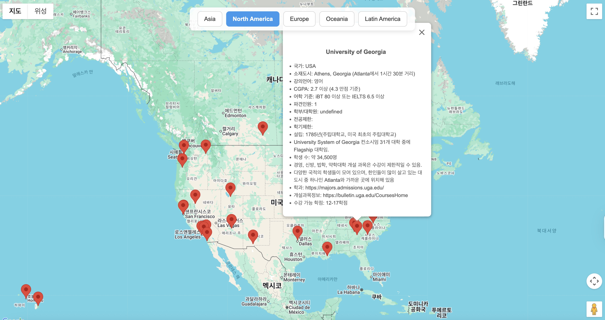
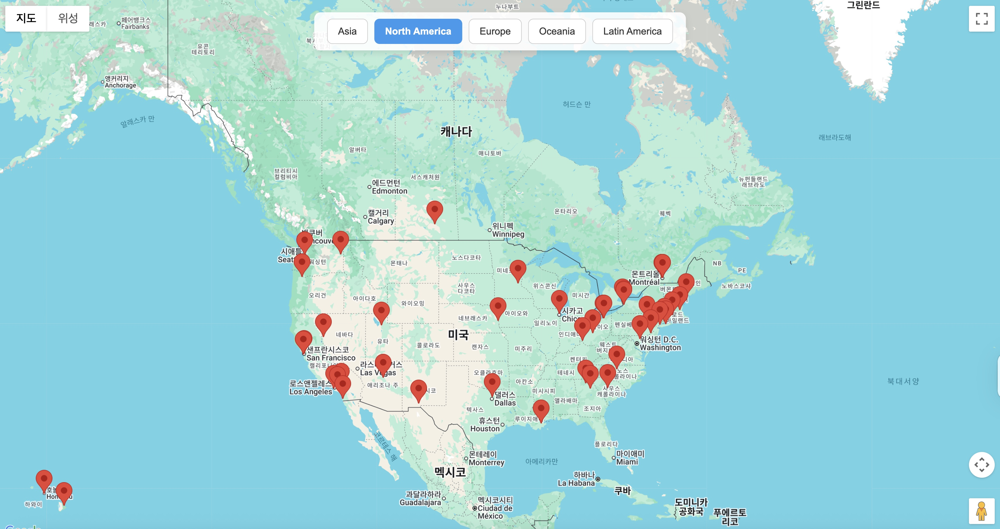
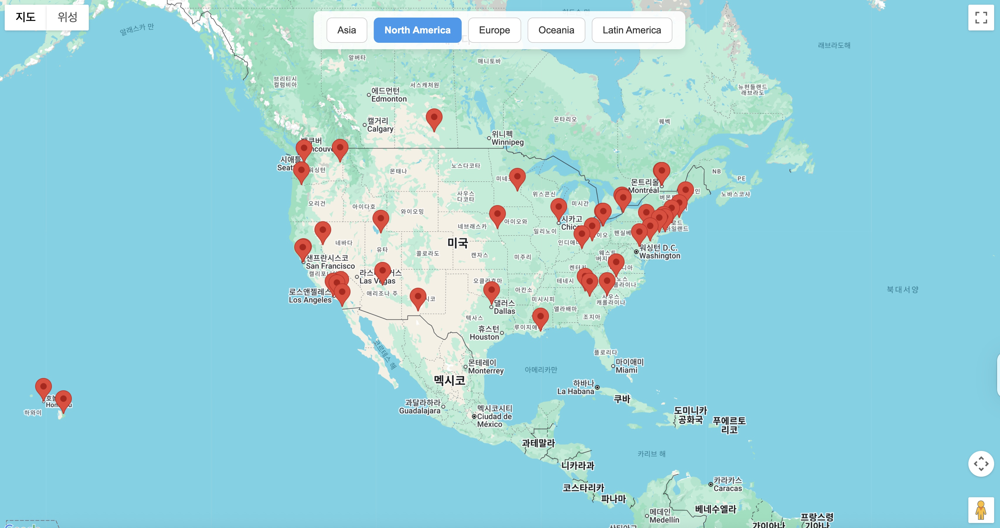
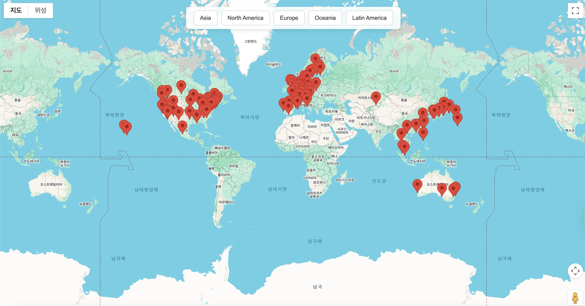

# 🌍 Exchange Univ Map

An interactive map showing universities available for student exchange programs of Sogang University, built using Google Maps JavaScript API.

## 📍 Website Screenshot

## 📌 Overview

This project visualizes partner institutions across continents for study-abroad programs of Sogang University. It aims to help students:

- View each university's location and basic info at a glance.
- Quickly filter schools by continent.
- Easily compare and explore options interactively.

## 🧩 Features

- 📍 Custom markers for each university
- 🗺️ Continent filtering with animated transitions
- 🪪 Hover preview & detailed info pop-up (language, CGPA, language scores, notes)
- Responsive layout and clean UI

## 🚀 Usage

1. Click a continent button at the top to view schools from that region.
2. Hover over a marker to see a summary.
3. Click a marker to view detailed information.
4. Return to global view by reloading the page.

## 🛠️ Technologies

- HTML, CSS, JavaScript
- Google Maps JavaScript API

## ⚠️ Disclaimer

Some information (e.g., school remarks or academic requirements) may include data provided by Sogang University. This site is for informational purposes only.

# 🌍 글로벌 파견기관 지도 

Google Maps API를 활용하여 서강대학교 교환학생 프로그램에 속한 전 세계 교류대학 정보를 시각적으로 제공하는 웹사이트입니다.

## 📌 프로젝트 소개

전 세계 대륙별 파견기관(교환/방문 유학 가능 대학)의 정보를 지도 위에서 확인하고, 필터링하여 탐색할 수 있도록 도와줍니다.

## ✨ 주요 기능

- 📍 파견기관별 마커 표시
- 🗺️ 대륙별 필터 버튼 (줌인 기능 포함)
- 🪪 마커에 마우스오버 시 요약 정보, 클릭 시 상세 정보
- 반응형 디자인으로 모바일 환경에서도 보기 좋게 구성

## ✅ 사용 방법

1. 상단의 버튼을 클릭해 원하는 대륙을 선택합니다.
2. 각 마커 위에 마우스를 올리면 간단한 요약 정보가 표시됩니다.
3. 마커를 클릭하면 학교의 상세 정보를 확인할 수 있습니다.

## 🛠️ 기술 스택

- HTML, CSS, JavaScript
- Google Maps JavaScript API

## ⚠️ 주의 사항

본 프로젝트에는 일부 학교나 기관에서 제공한 정보가 포함되어 있으며, 공식 자료와 다를 수 있습니다. 참고용으로만 활용해 주세요.

